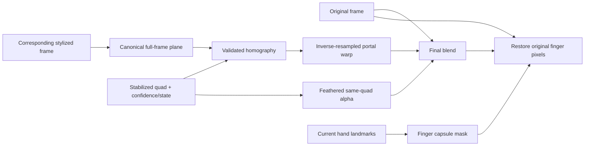

# Milestone 3: Perspective-Aware, Occlusion-Aware Compositing

**Completed:** 2026-08-15  
**Scope:** Compositing only.  
**Default:** stabilized tracking with `perspective_occlusion` compositing.

Gemini, prompt/style architecture, generation, MediaPipe detection, tracking thresholds, FPS, duration, resolution, and audio handling remain unchanged. No Milestone 4 reference-image work was started.

## 1. Legacy Compositor Architecture and Weaknesses

The preserved Milestone 0/2 path is:

```text
source frame
  + same-time whole-frame stylized frame
  + tracked anatomical/stabilized quad
      -> uint8 fillPoly mask
      -> mask * tracker presence
      -> straight BGR float32 blend at identical screen coordinates
      -> dashed outline and corner dots
      -> final frame
```

The stylized frame is resized to source dimensions when necessary. No transform exists in legacy mode: pixels inside the quad reveal the same screen-space coordinates from the stylized frame. The mask is hard, the portal center and edge use one uniform presence alpha, and fingers inside the polygon are overwritten. Invalid/missing quads draw nothing; dropout behavior comes solely from the tracker.

The branch remains available as:

```powershell
--tracking-mode legacy --compositing-mode legacy
```

It reproduced the Milestone 0 MP4 byte-for-byte with SHA-256 `8A7903B7C03FC7B1EA642B7E08193B088B01B9DE0FB2D9ED6D41DD8DFFA37F0A`.

## 2. New Compositing Architecture



`perspective_compositor.py` is the OpenCV numeric reference. `compositing.js` provides the browser counterpart. Both are provider-agnostic and accept an already-generated frame.

## 3. Canonical Portal Plane, Homography, and Orientation

The canonical plane is resolution-independent and spans the current output frame:

```text
TL (0, 0)                 TR (width-1, 0)
BL (0, height-1)          BR (width-1, height-1)
```

In clockwise array order it is `TL, TR, BR, BL`, matching Milestone 2's stabilized quad. Python computes the source-to-destination transform with OpenCV `getPerspectiveTransform`; `warpPerspective(..., INTER_LINEAR)` performs inverse-mapped bilinear sampling into the destination image. The browser solves the same eight homography coefficients and draws a 12x8 projective mesh as affine triangles under one same-quad mask.

Reversed winding, self-intersection, corner swaps, and singular transforms are rejected rather than mirrored or silently repaired.

## 4. Portal Content and Aspect-Ratio Policy

Milestone 3 retains whole-frame AI generation. The complete corresponding stylized frame is therefore the canonical portal texture (Approach A), with no dynamic crop and no content-dependent selection. If dimensions differ, Python resizes once to output dimensions using bilinear interpolation; browser drawing targets output dimensions.

This policy is deterministic and preserves all generated-frame content and temporal correspondence. The quad is treated as the projective image of the full-frame rectangle, so perspective changes its visible edge lengths. It avoids a crop window that would swim as the hands move, but a hand frame whose physical aspect is very different from the video can visibly compress content; that is a known limitation.

## 5. Perspective Mask and Controlled Feathering

Warp, mask, and feather all use the same stabilized quad. Python rasterizes at 2x, computes an inward distance transform, scales it to `[0,1]`, and downsamples. This keeps the portal center fully opaque and all pixels outside the quad at zero, avoiding black/white blur halos and premultiplication artifacts.

Adaptive width:

```text
feather_px = clamp(portal_short_side * 0.025,
                   1.5 * resolution_scale,
                   12 * resolution_scale)
resolution_scale = sqrt(frame_area / (320 * 180))
```

The browser uses the same width rule with a blurred mask clipped back inside the sharp quad.

Measured synthetic edge properties at 320x180:

- Alpha range: `0.0` through `1.0`.
- Opaque center alpha: `1.0`.
- Transition pixels: `2,231` (`3.8733%` of the frame).
- Nonzero pixels in a known outside region: `0`.

Blending is straight float32 BGR in Python, clipped before conversion to `uint8`; the MediaPipe RGB conversion remains isolated to inference. Browser Canvas handles its native RGBA compositing. No color grading was added.

## 6. Finger/Hand Occlusion

MediaPipe Hand Landmarker does not provide a segmentation matte in the current pipeline. A new heavy model was not justified, so the validated fallback uses landmark geometry:

- Index finger chain: MCP 5 -> PIP 6 -> DIP 7 -> tip 8.
- Thumb chain: MCP 2 -> IP 3 -> tip 4.
- Rounded line/capsule thickness: `clamp(hand_scale * 0.22, 5 px, 8% of short frame dimension)`.
- Mask feather: approximately `0.8 px`, resolution-resampled and anti-aliased.

Composition order is explicit:

```text
original -> feathered portal warp -> restore original through finger mask -> final
```

Only mask overlap with the portal changes the output, so the geometric mask cannot erase unrelated portal regions. During short predicted/held/rejected tracker states, the last valid occlusion mask is reused with confidence decay; it is not retained after unrelated lost/reset states.

Synthetic occlusion measurements:

| Metric | Result |
|---|---:|
| Expected hard foreground area | 3,238 px |
| Actual hard foreground area | 3,238 px |
| Foreground/portal overlap | 2,855 px |
| Restored-pixel coverage | 75.2715% |
| Unintentionally removed portal-free pixels | 0.0081% |

The restored-coverage metric uses a strict 15-level color-distance threshold; feathered boundary pixels are intentionally partial rather than counted as fully restored.

## 7. Confidence-Aware Policy

Invalid/reset state or confidence below `0.10` draws no portal. Between `0.10` and `0.65`, opacity uses smoothstep:

```text
t = clamp((confidence - 0.10) / 0.55, 0, 1)
base_opacity = t*t*(3 - 2*t)
```

State factors are:

| State | Factor |
|---|---:|
| detected / legacy | 1.00 |
| predicted | 0.85 |
| held | 0.65 |
| rejected | 0.55 |
| lost | 0.35 |
| reset / invalid | 0.00 |

This uses Milestone 2 geometry directly and adds no second tracking filter. The only transform-level safeguard is validation of each homography.

## 8. Degenerate Geometry and Off-Screen Handling

The compositor rejects:

- non-finite or non-four-point input;
- self-intersection or non-positive winding;
- non-convex/nearly collinear geometry;
- area below `max(4 px, 0.01% of frame area)`;
- edges below `2 px`;
- edge ratio above `25:1`;
- less than 2% visible polygon area;
- non-finite, singular, ill-conditioned, or inaccurately reprojecting homographies.

Partially off-screen convex portals are accepted. OpenCV output bounds and Canvas clipping safely discard pixels outside the frame. Failure returns the unchanged original frame and increments an explicit invalid-transform counter.

## 9. Synthetic Fixtures and Accuracy

`tests/compositing_fixtures.py` creates checkerboards, straight grid lines, colored corner labels (`TL/TR/BR/BL`), solid color pairs, and deterministic hand landmarks. Tests cover identity, translation, rotation, scale, trapezoids, orientation, degeneration, self-intersection, partial off-screen geometry, small/large portals, adaptive feathering, occlusion restoration, confidence, prediction states, deterministic output, 320x180, 640x360, and 1280x720.

Across identity, trapezoid, rotated/scaled, and partially off-screen control quads:

| Accuracy metric | Result |
|---|---:|
| Mean corner reprojection error | `0.0000000000 px` |
| Maximum corner reprojection error | `0.0000000000 px` |
| Mean interior inverse round-trip error | `0.0000019824 px` |
| Maximum interior inverse round-trip error | `0.0000085299 px` |

## 10. Temporal Stability

The 70-frame Milestone 2 smooth-translation fixture was passed through the homography/mask stage:

| Metric | Result |
|---|---:|
| Valid transforms | 70 / 70 |
| Invalid transform frames | 0 |
| Mean projected portal-center motion | 2.225666 px/frame |
| Portal-center motion variance | 0.32576948 |
| Feathered mask-area variance | `0.000000392125` |
| Mean/max projective center vs vertex-average center | 0.314356 / 0.437170 px |

The last difference is expected for a perspective trapezoid: the projected canonical center need not equal the arithmetic mean of its four destination vertices. No extra transform jitter or invalid frame was introduced.

## 11. Performance

The isolated 320x180 compositor benchmark ran 100 repetitions per mode, excluding tracking and MediaPipe:

| Mode | Average | Median | Maximum |
|---|---:|---:|---:|
| Legacy mask/blend | 2.125689 ms/frame | 2.121050 | 2.569900 |
| Perspective + feather | 4.768961 ms/frame | 4.768650 | 5.512700 |
| Perspective + feather + occlusion | 6.344849 ms/frame | 6.282300 | 7.820300 |

The real 24-frame fixture measured `6.078167 ms/frame` average and `8.280100 ms/frame` maximum for the perspective+occlusion layer. This remains practical for the existing offline pipeline.

Reproduce the synthetic report:

```powershell
.\.venv\Scripts\python.exe scripts\compare_compositing.py --benchmark-repeats 100
```

## 12. Debug Visualization

The 2x2 diagnostic video contains final composite + stabilized quad/state, warped portal with canonical labels, portal alpha, and finger occlusion alpha:

```powershell
.\.venv\Scripts\python.exe composite.py `
  tests\fixtures\finger_frame_short.mp4 `
  tests\fixtures\finger_frame_short_stylized.mp4 `
  -o tests\artifacts\milestone3_perspective_occlusion.mp4 `
  --tracking-mode stabilized `
  --compositing-mode perspective_occlusion `
  --debug-compositing tests\artifacts\milestone3_compositing_debug.mp4
```

The generated diagnostic was visually inspected at its midpoint. The content followed the tracked trapezoid with correct orientation, no black gaps, a full-opacity interior, an inward feather, and localized index/thumb occlusion masks. Canonical labels were readable in `TL/TR/BR/BL` order.

## 13. Modes and Regression Results

Offline modes:

```text
legacy
perspective
perspective_occlusion   # default
```

Browser development query:

```text
?compositing=legacy
?compositing=perspective
default -> perspective_occlusion
```

Validation results:

- Python: 41 tests passed, including all Milestone 0–2 tests and 13 new compositor tests.
- Frontend: 18 tests passed, including all prompt/Gemini/tracking tests and 3 homography/compositor tests.
- Live browser: perspective+occlusion and legacy fixture previews both reached 2.0 seconds at 320x180 with no console errors; perspective output was visually inspected.
- Static production build includes `tracking.js` and `compositing.js`.
- Default real fixture: 24/24 valid transforms, 0 invalid, 320x180, 12 FPS, 24 H.264 frames, 2.000000 seconds, AAC 48 kHz mono.
- Legacy tracker+compositor output remains byte-identical to Milestone 0.
- Prompt builder, style presets, custom prompt validation, Gemini request/model contract, stabilized tracker metrics, generation flow, FPS, duration, resolution, and audio behavior remain intact.

## 14. Known Limitations and Recommended Next Step

- Landmark capsules approximate visible fingers; they are not a semantic hand matte and can miss unusual poses or restore a little background between projected finger joints.
- The committed real fixture is short and derived from an existing composite. Broader consented footage is still needed for difficult motion, skin tones, blur, crossing, and lighting.
- Browser perspective uses a 12x8 affine mesh approximation because Canvas 2D has no native projective texture primitive. It passed the visual fixture check but can show small subdivision seams under extreme perspective; Python/OpenCV is exact.
- Full-frame mapping can compress content when portal and video aspect cues differ substantially.
- The portal boundary can inherit any outline already baked into the input fixture; perspective mode itself does not add the legacy dashed outline.
- Confidence and dropout thresholds remain frame-based through Milestone 2.

The compositor accepts arbitrary stylized frames and is ready for Milestone 4 to add reference-image conditioning upstream. The recommended next step is to keep this provider-independent frame interface unchanged and validate future generation sources against the same checkerboard/orientation/media contracts. No reference-image behavior is implemented in Milestone 3.

